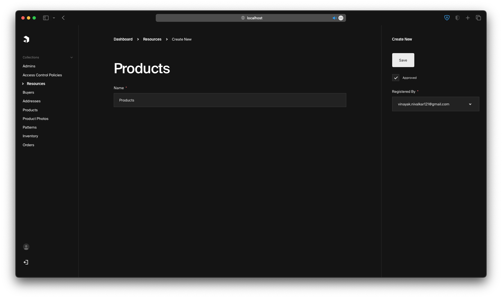
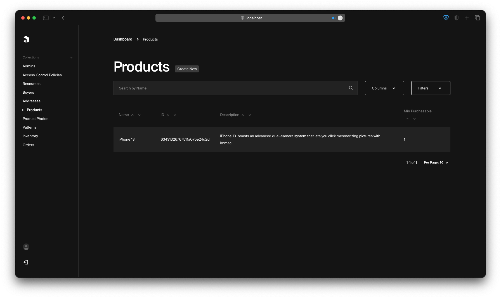

# Fiume CMS

### This is the Content Management System for Fiume (the Ecommerce Store)

- Supports Access Control (Resource and Policy Based)
- Supports Admin and Buyer Onboarding
- Inventory Management
- Order Management
- Products CRUD including productPhotos, Variants and Patterns etc

